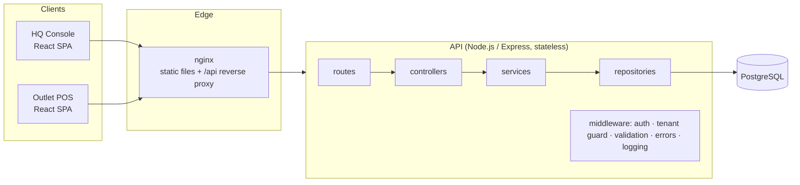
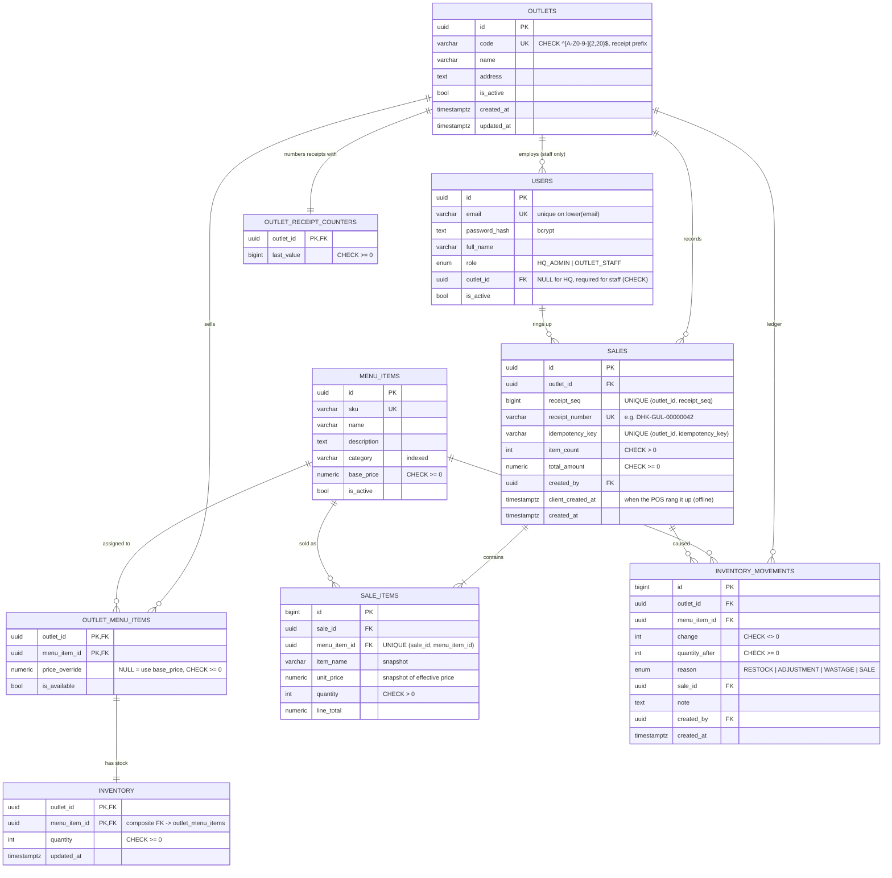
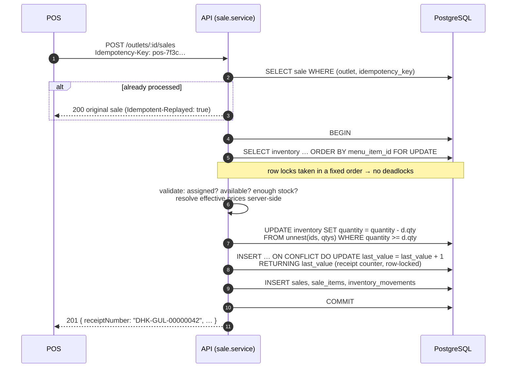
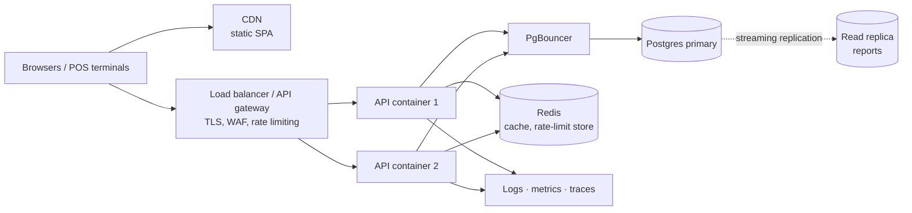

# Architecture Documentation

> F&B HQ / multi-outlet platform: HQ owns the master menu, assigns items to outlets
> with optional price overrides, and monitors sales. Outlets sell, deduct their own
> stock and issue their own sequential receipts.

**Contents**

1. [System overview](#1-system-overview)
2. [ERD: database schema and relationships](#2-erd-database-schema-and-relationships)
3. [Critical flow: creating a sale](#3-critical-flow-creating-a-sale)
4. [Scaling plan: 10 outlets, 100,000 transactions/month](#4-scaling-plan-10-outlets-100000-transactionsmonth)
5. [Evolving to microservices](#5-evolving-to-microservices)
6. [Offline POS mode strategy (POS + KDS)](#6-offline-pos-mode-strategy-pos--kds)

---

## 1. System overview

| Layer | Responsibility | Knows about HTTP? | Knows about SQL? |
|---|---|---|---|
| **routes** | URL + method → middleware chain (auth, role, tenant guard, validation) → controller | yes | no |
| **controllers** | Read validated input from `req.valid`, call one service, shape the HTTP response (status, headers) | yes | no |
| **services** | Business rules, transactions, orchestration of repositories, domain errors | no | no |
| **repositories** | All data access (Prisma queries + raw SQL where locking/window functions are needed) | no | yes |
| **validators** | zod schemas; the single source of truth for request shapes and TS types | – | – |
| **mappers** | DB rows → API DTOs (Decimal → number, BigInt → number, hide password hashes) | – | – |

**Cross-cutting concerns:** env config validated at boot (fail fast) · structured JSON logs (pino) with a request id
propagated from nginx · helmet security headers · CORS allow-list · rate-limited login · centralised error
middleware that turns domain errors *and* DB constraint violations into consistent `{ error: { code, message,
details, requestId } }` responses · liveness/readiness probes · graceful shutdown.

**Security model:** JWT bearer tokens. `HQ_ADMIN` can reach everything. `OUTLET_STAFF` is bound to one
outlet (`users.outlet_id`, enforced by a CHECK). The `authorizeOutlet` middleware rejects any
`/outlets/:outletId/**` request for another outlet, so **tenant isolation is enforced server-side**, not by the UI.

---

## 2. ERD: database schema and relationships

### Key design decisions

| Decision | Why |
|---|---|
| **`outlet_menu_items` join table with nullable `price_override`** | Many-to-many between outlets and the master menu. `effective_price = COALESCE(price_override, base_price)`, so a change to the HQ base price automatically flows to every outlet that hasn't overridden it. |
| **`inventory` separate from `outlet_menu_items`** | Stock rows are the hottest rows in the system (updated on every sale). Keeping them apart from menu configuration means a price change never contends with checkout locks. |
| **Composite FK `inventory → outlet_menu_items`** | Stock *cannot exist* for an item that isn't assigned to the outlet; unassigning cascades the stock row away. The rule lives in the schema, not only in code. |
| **`CHECK (quantity >= 0)`** | Negative stock is impossible even if a future code path forgets the application-level guard. |
| **Receipt counter table (not a `SEQUENCE`)** | PostgreSQL sequences are non-transactional: a rolled-back sale would burn a number and leave a **gap**. A counter row updated *inside* the sale transaction is gap-free, per outlet, and rolls back with the sale. |
| **`UNIQUE (outlet_id, receipt_seq)` + `UNIQUE (receipt_number)`** | Belt-and-braces: even a bug could never issue a duplicate receipt. |
| **`UNIQUE (outlet_id, idempotency_key)`** | Makes `POST /sales` safely retryable (network timeouts, offline POS replay). |
| **Price + name snapshot on `sale_items`** | Historical sales and reports stay correct after menu prices or names change. |
| **`inventory_movements` ledger** | Every stock change (sale, restock, wastage, correction) is auditable; stock can be reconciled from the ledger. |
| **NUMERIC(12,2) for money, integer cents in code** | No floating-point rounding errors anywhere. |
| **UUID primary keys (`gen_random_uuid()`)** | Non-guessable ids in URLs; ids can be generated by clients/offline devices and merged without collisions. |

### Indexes and the queries they serve

| Index | Serves |
|---|---|
| `outlet_menu_items (outlet_id, menu_item_id)` PK | "menu for outlet X" (the most frequent read) |
| `outlet_menu_items (menu_item_id)` | "which outlets sell item Y", FK checks on `menu_items` |
| `inventory (outlet_id, menu_item_id)` PK | stock lookups + `SELECT … FOR UPDATE` at checkout |
| `sales (outlet_id, created_at DESC)` | outlet sales history (paginated), outlet-scoped reports |
| `sales (created_at)` | company-wide date-range reports |
| `sale_items (sale_id, menu_item_id)` unique | loading a sale's lines; the join in top-items reports |
| `sale_items (menu_item_id)` | per-item sales analysis, FK checks |
| `inventory_movements (outlet_id, menu_item_id, created_at DESC)` | stock history per outlet/item |
| `inventory_movements (sale_id)` | ledger entries for a sale |
| `users (lower(email))` unique | case-insensitive login lookup |
| `users (outlet_id)`, `menu_items (category)`, `outlets (code)`, `menu_items (sku)` | filters + FK checks |

---

## 3. Critical flow: creating a sale

**Why it is correct under concurrency**

* **No overselling:** concurrent sales of the same item serialise on the inventory row lock. The second
  transaction re-reads the *committed* quantity after the first commits (READ COMMITTED + `FOR UPDATE`), so
  it sees the real remaining stock. The guarded `UPDATE … WHERE quantity >= qty` and the CHECK constraint are
  two more independent safety nets.
* **Sequential, unique, gap-free receipts per outlet:** the counter row is locked until COMMIT/ROLLBACK, so
  only one transaction per outlet holds "the next number" at a time; a failed sale rolls its number back.
  Different outlets have different counter rows and never block each other. The lock is taken *last* to keep
  the per-outlet critical section as short as possible.
* **No deadlocks:** every transaction locks inventory rows in `menu_item_id` order, then the counter.
  A consistent global lock order makes lock cycles impossible.
* **All-or-nothing:** one DB transaction; any error rolls back stock, receipt number, sale and ledger.
* **Retry-safe:** idempotency key pre-check + unique constraint. If two identical requests race, the loser's
  unique violation is caught and the winner's sale is returned.

These properties are **verified by integration tests** against a real PostgreSQL
(`backend/tests/sales.test.ts`): 30 parallel requests against stock 10 → exactly 10 sales, receipts
1..10, stock 0; two outlets selling concurrently keep independent gap-free sequences; 8 concurrent
requests with the same idempotency key → exactly one sale; opposite-order carts → no deadlock.

---

## 4. Scaling plan: 10 outlets, 100,000 transactions/month

### 4.1 Sizing the problem

| Metric | Estimate |
|---|---|
| Transactions / month | 100,000 |
| Average | ≈ 3,300 / day ≈ **0.04 TPS** |
| Peak (lunch/dinner: ~15% of a day's sales in the busiest hour, ×3 safety) | ≈ 500 / hour ≈ **0.4 TPS** |
| Sale items (≈ 3 lines / sale) | ≈ 300k rows / month → **3.6M rows / year** |
| Inventory movements | ≈ 3.6M rows / year |
| Storage (sales + items + ledger, with indexes) | ≈ 2–3 GB / year |

**Conclusion:** this is a modest OLTP load. A single, well-indexed PostgreSQL instance handles it with
headroom of two or more orders of magnitude. The current design (stateless API, row-level locks scoped
per outlet, per-outlet counters) already avoids global hot spots. The work is mostly about **reliability,
reporting efficiency and operability**, not raw throughput. The plan below is staged so each step is taken
when a metric says so, not up front.

### 4.2 Database scaling strategies

| Stage | Action | Trigger |
|---|---|---|
| 1 | **Managed PostgreSQL** (RDS / Cloud SQL / Neon) with automated backups, PITR, Multi-AZ standby for failover | Day 1 in production |
| 2 | **Connection pooling** with PgBouncer (transaction mode) or RDS Proxy; small per-instance pools in the app | > 3–4 API instances, or serverless API |
| 3 | **Read replica** for reporting and HQ dashboards; the app gets a separate read-only Prisma client | Reports noticeably load the primary (p95 checkout latency rises during report runs) |
| 4 | **Partition `sales`, `sale_items`, `inventory_movements` by month** (declarative range partitioning on `created_at`) | ~50M+ rows, or when retention/archival is needed; old partitions detach to cheap storage |
| 5 | **Archive cold data** (> 2 years) to object storage (Parquet) queried via the warehouse | Storage cost / backup time |
| – | Keep: row-level locks per outlet (no table locks), short transactions, `EXPLAIN ANALYZE` on every new report query, `pg_stat_statements` to find slow queries | Always |

Sharding is **not** needed at this scale. If it ever were (hundreds of outlets, multiple countries),
`outlet_id` is the natural shard key: every write transaction is already scoped to one outlet.

### 4.3 Reporting performance considerations

The current reports aggregate raw `sales`/`sale_items` on each request. That's fine for thousands of rows
per outlet and for the seeded data, but the cost grows linearly with history. The plan:

1. **Pre-aggregated rollup table** `daily_outlet_item_sales (date, outlet_id, menu_item_id, qty, revenue,
   txn_count)`, maintained **incrementally** (upsert in the sale transaction or from an outbox consumer).
   "Revenue by outlet" and "top 5 items" then read ~10 outlets × ~50 items × N days, which stays small no
   matter how many transactions there are. (A materialized view refreshed `CONCURRENTLY` every few minutes
   is the simpler first step.)
2. **Hybrid freshness:** rollups for closed days + live query for *today only* → real-time dashboards at
   constant cost.
3. **Serve reports from the read replica** so a heavy HQ query can never slow down a checkout.
4. **Cache** hot dashboard queries in Redis for 30–60s, keyed by (report, range); invalidated or simply
   left to expire.
5. **Covering indexes** where plans show heap fetches, e.g. `sales (outlet_id, created_at) INCLUDE
   (total_amount)` for revenue-by-outlet as an index-only scan.
6. **Analytics beyond operational reports** (cohorts, basket analysis, forecasting) go to a warehouse
   (BigQuery / Redshift / ClickHouse) fed by CDC (Debezium) or nightly exports. OLAP never runs on the
   OLTP primary.
7. **Time zones:** aggregate by outlet-local business day (store an `outlet.timezone`, compute
   `business_date` at write time) so "today's sales" matches the outlet's day, not UTC.

### 4.4 Infrastructure considerations

* **Stateless API containers** (already true: JWT auth, no in-memory session) behind a load balancer on
  ECS Fargate / Cloud Run / Kubernetes; autoscale on CPU and p95 latency; minimum 2 instances across AZs.
* **Frontend on a CDN** (S3 + CloudFront / Netlify): static, cached, globally fast.
* **CI/CD:** lint → typecheck → tests against a real Postgres service container → build image → run
  `prisma migrate deploy` as a one-off release job → rolling / blue-green deploy. Migrations are written
  expand-then-contract so old and new versions can run side by side.
* **Secrets** in a secrets manager (not env files); `JWT_SECRET` rotation via key ids.
* **Observability:** structured logs with request ids (already emitted) shipped to a log platform; RED
  metrics (rate, errors, duration) per endpoint; OpenTelemetry tracing; alerts on checkout error rate,
  p95 latency, DB connections, replication lag, and `INSUFFICIENT_STOCK` spikes (a business signal).
* **Reliability:** health/readiness probes (already implemented), graceful shutdown (already implemented),
  PITR backups with regular restore drills, documented RPO/RTO.
* **Security:** TLS everywhere, WAF, per-user rate limiting, audit log for HQ actions (price changes,
  assignments), refresh tokens with short-lived access tokens, and optional SSO for HQ staff.

### 4.5 Architectural evolution

1. **Now: modular monolith.** Layers are already separated and modules are cohesive (catalog, outlet
   menu, inventory, sales, reporting). This is the right shape for this load and team size.
2. **Transactional outbox.** Write `sale.completed` / `stock.adjusted` events to an `outbox` table in the
   same transaction as the sale; a relay publishes them to a queue (SQS/SNS, RabbitMQ, or Kafka). This
   decouples side effects (rollups, notifications, loyalty, KDS, accounting export) without
   dual-write bugs.
3. **Async projections.** Reporting rollups, low-stock alerts and the warehouse feed become consumers
   of those events.
4. **Extract services where boundaries are proven** (see §5), starting with reporting, the one that
   benefits most from independent scaling and storage.
5. **Offline-first POS** at the edge (see §6), which also improves resilience at every scale.

---

