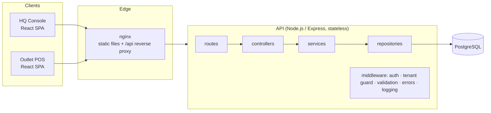

# Architecture Documentation

> F&B HQ / multi-outlet platform: HQ owns the master menu, assigns items to outlets
> with optional price overrides, and monitors sales. Outlets sell, deduct their own
> stock and issue their own sequential receipts.

**Contents**

1. [System overview](#1-system-overview)
2. [ERD: database schema and relationships](#2-erd-database-schema-and-relationships)
3. [Critical flow: creating a sale](#3-critical-flow-creating-a-sale)
4. [Scaling plan: 10 outlets, 100,000 transactions/month](#4-scaling-plan-10-outlets-100000-transactionsmonth)
5. [Evolving to microservices](#5-evolving-to-microservices)
6. [Offline POS mode strategy (POS + KDS)](#6-offline-pos-mode-strategy-pos--kds)

---

## 1. System overview

| Layer | Responsibility | Knows about HTTP? | Knows about SQL? |
|---|---|---|---|
| **routes** | URL + method → middleware chain (auth, role, tenant guard, validation) → controller | yes | no |
| **controllers** | Read validated input from `req.valid`, call one service, shape the HTTP response (status, headers) | yes | no |
| **services** | Business rules, transactions, orchestration of repositories, domain errors | no | no |
| **repositories** | All data access (Prisma queries + raw SQL where locking/window functions are needed) | no | yes |
| **validators** | zod schemas; the single source of truth for request shapes and TS types | – | – |
| **mappers** | DB rows → API DTOs (Decimal → number, BigInt → number, hide password hashes) | – | – |

**Cross-cutting concerns:** env config validated at boot (fail fast) · structured JSON logs (pino) with a request id
propagated from nginx · helmet security headers · CORS allow-list · rate-limited login · centralised error
middleware that turns domain errors *and* DB constraint violations into consistent `{ error: { code, message,
details, requestId } }` responses · liveness/readiness probes · graceful shutdown.

**Security model:** JWT bearer tokens. `HQ_ADMIN` can reach everything. `OUTLET_STAFF` is bound to one
outlet (`users.outlet_id`, enforced by a CHECK). The `authorizeOutlet` middleware rejects any
`/outlets/:outletId/**` request for another outlet, so **tenant isolation is enforced server-side**, not by the UI.

---

## 2. ERD: database schema and relationships

### Key design decisions

| Decision | Why |
|---|---|
| **`outlet_menu_items` join table with nullable `price_override`** | Many-to-many between outlets and the master menu. `effective_price = COALESCE(price_override, base_price)`, so a change to the HQ base price automatically flows to every outlet that hasn't overridden it. |
| **`inventory` separate from `outlet_menu_items`** | Stock rows are the hottest rows in the system (updated on every sale). Keeping them apart from menu configuration means a price change never contends with checkout locks. |
| **Composite FK `inventory → outlet_menu_items`** | Stock *cannot exist* for an item that isn't assigned to the outlet; unassigning cascades the stock row away. The rule lives in the schema, not only in code. |
| **`CHECK (quantity >= 0)`** | Negative stock is impossible even if a future code path forgets the application-level guard. |
| **Receipt counter table (not a `SEQUENCE`)** | PostgreSQL sequences are non-transactional: a rolled-back sale would burn a number and leave a **gap**. A counter row updated *inside* the sale transaction is gap-free, per outlet, and rolls back with the sale. |
| **`UNIQUE (outlet_id, receipt_seq)` + `UNIQUE (receipt_number)`** | Belt-and-braces: even a bug could never issue a duplicate receipt. |
| **`UNIQUE (outlet_id, idempotency_key)`** | Makes `POST /sales` safely retryable (network timeouts, offline POS replay). |
| **Price + name snapshot on `sale_items`** | Historical sales and reports stay correct after menu prices or names change. |
| **`inventory_movements` ledger** | Every stock change (sale, restock, wastage, correction) is auditable; stock can be reconciled from the ledger. |
| **NUMERIC(12,2) for money, integer cents in code** | No floating-point rounding errors anywhere. |
| **UUID primary keys (`gen_random_uuid()`)** | Non-guessable ids in URLs; ids can be generated by clients/offline devices and merged without collisions. |

### Indexes and the queries they serve

| Index | Serves |
|---|---|
| `outlet_menu_items (outlet_id, menu_item_id)` PK | "menu for outlet X" (the most frequent read) |
| `outlet_menu_items (menu_item_id)` | "which outlets sell item Y", FK checks on `menu_items` |
| `inventory (outlet_id, menu_item_id)` PK | stock lookups + `SELECT … FOR UPDATE` at checkout |
| `sales (outlet_id, created_at DESC)` | outlet sales history (paginated), outlet-scoped reports |
| `sales (created_at)` | company-wide date-range reports |
| `sale_items (sale_id, menu_item_id)` unique | loading a sale's lines; the join in top-items reports |
| `sale_items (menu_item_id)` | per-item sales analysis, FK checks |
| `inventory_movements (outlet_id, menu_item_id, created_at DESC)` | stock history per outlet/item |
| `inventory_movements (sale_id)` | ledger entries for a sale |
| `users (lower(email))` unique | case-insensitive login lookup |
| `users (outlet_id)`, `menu_items (category)`, `outlets (code)`, `menu_items (sku)` | filters + FK checks |

---

